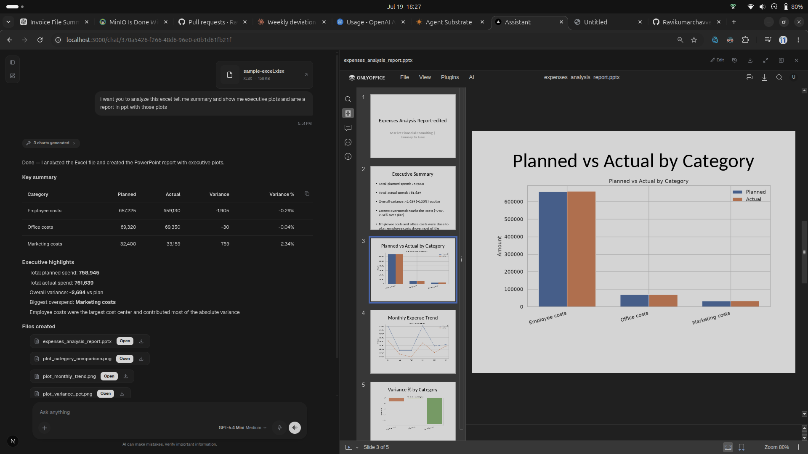

<div align="center">


# substrate-ui

**The chat that hands you back editable files — not just text.**

An AI-agent chatbot shell where the assistant's work opens in a side panel and
you can *edit it in place* — spreadsheets, docs, slides, and code — while the
agent keeps working on the same files, without either of you clobbering the
other.

<p>
  
  
  
  
</p>



</div>

---

## What it does

`substrate-ui` is the end-user chatbot for the **agent-framework** platform. It
streams an agent's responses and renders them as a live, interactive workspace —
then lets you take the wheel on anything the agent produces.

- 💬 **Streaming chat** — responses stream over SSE with reasoning, tool calls,
  and a collapsible tool-progress summary.
- 📎 **Artifact panel** — code-interpreter output (HTML / PDF / images / CSV /
  Office / code) opens on the right, Claude/ChatGPT-style. The main artifact
  auto-opens when a run finishes.
- ✍️ **Edit in place, with versioning** — Office files open in
  **BetterOffice** (client-side, no server needed) and code/text in
  **Monaco**, saving back through a version lineage so **human edits and the
  agent's rewrites reconcile instead of overwriting each other**.
- ✅ **Human-in-the-loop** — the agent can pause and ask; approval cards render
  inline.
- 🗂️ **Live task board** — a Kanban board mirrors the agent's task manager.
- 🧩 **MCP App widgets** — tools can ship interactive UIs into the panel.

## Screenshots

<div align="center">
  
</div>

> More screenshots can be dropped into [`docs/screenshots/`](docs/screenshots/)
> and referenced here — the BetterOffice editor, the version-history dropdown,
> and the Monaco code editor each make a good shot.

## How it fits together

```
ravi (SaaS control plane)
  └─ user creates a chatbot Instance
        └─ substrate-ui  ← you are here (the chat shell)
              └─ talks to agent-substrate over HTTP + SSE
                    └─ agent runtime: tools, code interpreter, workspace files, versioning
```

The engine ([`agent-substrate`](../agent-substrate)) does the real work; this app
is the interface. Office editing runs entirely client-side via BetterOffice —
no separate document server.

## Quick start

```bash
pnpm install --frozen-lockfile
cp .env.local.example .env.local     # fill in the values below
pnpm prisma generate                 # runs on install too
pnpm db:push                         # provision auth/session tables
pnpm dev                             # http://localhost:3000
```

The backend must run separately — see
[`agent-substrate`](../agent-substrate) (`uv run start`, port 8000).

<details>
<summary><b>Scripts</b></summary>

```bash
pnpm dev            # dev server
pnpm build          # production build
pnpm start          # serve the production build
pnpm lint           # ESLint
pnpm typecheck      # tsc --noEmit
pnpm test           # vitest
pnpm db:studio      # Prisma Studio
```
</details>

## Environment

Copy `.env.local.example` → `.env.local`:

| Variable | Purpose |
|---|---|
| `BACKEND_API_URL` | Engine URL for server-side routes / the `/api/backend/*` proxy (default `http://localhost:8000`). |
| `NEXT_PUBLIC_API_URL` | Engine URL baked into the browser bundle. Leave empty on Kubernetes so the browser uses ingress-relative paths. |
| `ENGINE_JWT_SECRET` | Must equal the engine's `JWT_SECRET`. The proxy signs a per-request JWT identifying the caller (per-user when logged in, else a service account). |
| `DATABASE_URL` | Prisma database for this app's own `User`/`UserCredential` tables. Auth here is hand-rolled Google OAuth + httpOnly cookies, not Auth.js/NextAuth — no `NEXTAUTH_*` vars are read anywhere. |
| `GOOGLE_CLIENT_ID` / `GOOGLE_CLIENT_SECRET` / `GOOGLE_REDIRECT_URI` | Google OAuth login. |
| `ENCRYPTION_KEY` | Encrypts stored Spotify/Workspace OAuth tokens (`openssl rand -hex 32`). Must be this exact name. |
| `ADMIN_EMAIL` | Grants access to `/api/admin/*`. |
| `BYPASS_OAUTH` | Dev-only: skip real Google OAuth and sign in as a placeholder account. Only takes effect when `NODE_ENV !== "production"` — never a live risk in a real deployment. |

> **Identity note:** `/api/chat` and the `/api/backend/*` proxy sign tokens from
> the same `user_session` cookie, so agent-written files and browser reads share
> one identity. Logged out, everything runs under the `substrate-ui` service
> account — files created then aren't visible once you log in as a real user.

## Architecture notes

- All backend calls go through the `api` object in `src/lib/api/` — never
  `fetch` directly in components.
- Server → engine calls flow through the `/api/backend/*` catch-all proxy
  ([`route.ts`](src/app/api/backend/%5B...path%5D/route.ts)), which injects the
  signed engine JWT.
- The chat page, SSE loop, and panel wiring live in
  [`src/app/page.tsx`](src/app/page.tsx); the artifact surfaces are
  [`FileArtifactViewer`](src/components/FileArtifactViewer.tsx),
  [`BetterOfficeEditor`](src/components/BetterOfficeEditor.tsx), and
  [`CodeEditorView`](src/components/CodeEditorView.tsx).

See [`.github/copilot-instructions.md`](.github/copilot-instructions.md) for
component conventions, the SSE event table, and Tailwind v4 rules.

## Docker

```bash
docker build -t substrate-ui .
```

Uses `node:22-alpine` (pnpm 11 requires Node ≥ 22.13) with pnpm pinned to the
lockfile's version.
